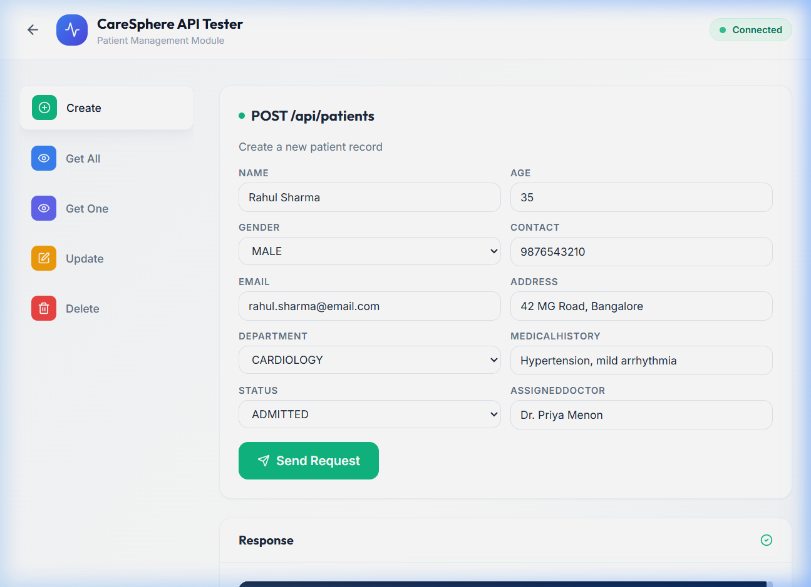
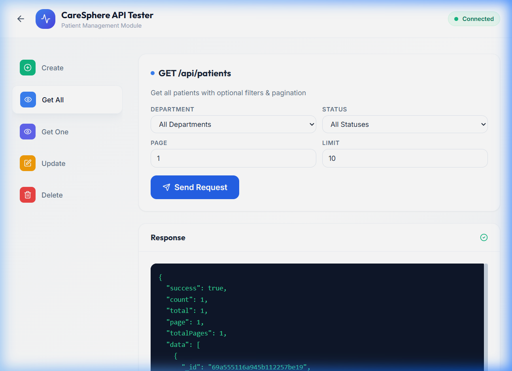

# CareSphere - Hospital Management System

CareSphere is a modern, full-stack Hospital Management System (HMS) built using the **MERN Stack**. It provides a comprehensive solution for managing patient records, appointments, and hospital workflows with a focus on ease of use and predictive analytics.


## 🚀 Features

- **Multi-Role Dashboards**: Specialized interfaces for Doctors, Patients, and Receptionists.
- **Patient Management**: Full CRUD operations for patient records with advanced filtering and pagination.
- **Appointment Scheduling**: Streamlined booking system for patients and doctors.
- **AI Chatbot**: Intelligent medical assistant to help patients with common queries.
- **Predictive Analytics**: ML-powered patient admission trends and data visualization using Recharts.
- **Role-Based Access Control**: Secure authentication and authorization using JWT and Bcrypt.
- **Modern UI/UX**: Responsive design built with React, Tailwind CSS, and Framer Motion for smooth animations.
- **API Tester**: Built-in interface for testing backend endpoints directly from the frontend.

## 🛠️ Technology Stack

| Layer | Technology |
|-------|------------|
| **Frontend** | React 18, Vite, Tailwind CSS, Framer Motion, Lucide React, Recharts |
| **Backend** | Node.js, Express.js |
| **Database** | MongoDB with Mongoose ODM |
| **Authentication** | JSON Web Tokens (JWT), Bcrypt.js |
| **ML/Analytics** | Regression.js for trend prediction |

## 📁 Project Structure

```text
mern-hospital-management/
├── server/                 # Backend (Node.js/Express)
│   ├── config/             # DB connection configuration
│   ├── controllers/        # Route controllers (CRUD logic)
│   ├── models/             # Mongoose schemas (User, Patient, Appointment)
│   ├── routes/             # API endpoints
│   └── server.js           # Entry point (Port 5000)
├── src/                    # Frontend (React + Vite)
│   ├── components/         # Reusable UI components
│   ├── pages/              # Dashboard and Auth pages
│   ├── context/            # Auth state management
│   ├── App.jsx             # Main routing logic
│   └── main.jsx            # React entry point
├── public/                 # Static assets
├── screenshots/            # Project documentation images
├── tailwind.config.js      # CSS configuration
└── vite.config.js          # Build tool configuration
```

## 📡 API Endpoints

| Method | Endpoint | Description |
|--------|----------|-------------|
| `POST` | `/api/auth/register` | User registration |
| `POST` | `/api/auth/login` | User login (JWT) |
| `GET` | `/api/patients` | Fetch all patient records |
| `POST` | `/api/patients` | Create a new patient record |
| `PUT` | `/api/patients/:id` | Update patient details |
| `DELETE` | `/api/patients/:id` | Remove patient record |
| `GET` | `/api/appointments`| Fetch scheduled appointments |
| `POST` | `/api/chatbot/chat`| Interact with the AI assistant |

## 🚦 Getting Started

### Prerequisites

- **Node.js**: v18 or later
- **MongoDB**: Local instance or MongoDB Atlas URI
- **npm** or **yarn**

### Installation

1. **Clone the repository**:
   ```bash
   git clone <repository-url>
   cd mern-hospital-management
   ```

2. **Frontend Setup**:
   ```bash
   npm install
   ```

3. **Backend Setup**:
   ```bash
   cd server
   npm install
   ```

4. **Environment Variables**:
   Create a `.env` file in the `server` directory:
   ```env
   PORT=5000
   MONGODB_URI=mongodb://localhost:27017/caresphere
   JWT_SECRET=your_super_secret_key
   ```

### Running the Application

1. **Start the Backend**:
   ```bash
   cd server
   npm run dev
   ```

2. **Start the Frontend**:
   ```bash
   # In a new terminal from the root
   npm run dev
   ```

3. **Access the App**:
   Open `http://localhost:5173` in your browser.

## 🧪 Testing the API

The application includes a built-in **API Tester**. You can access it by clicking the 🧪 icon in the navigation bar or floating button to test all CRUD operations without external tools like Postman.

## 📸 Screenshots

| Landing Page | Dashboard |
|--------------|-----------|
|  |  |

## 📜 License

This project is licensed under the MIT License - see the LICENSE file for details.

---

**Developed by Akash Prasad M (CB.SC.U4CSE23703)**
